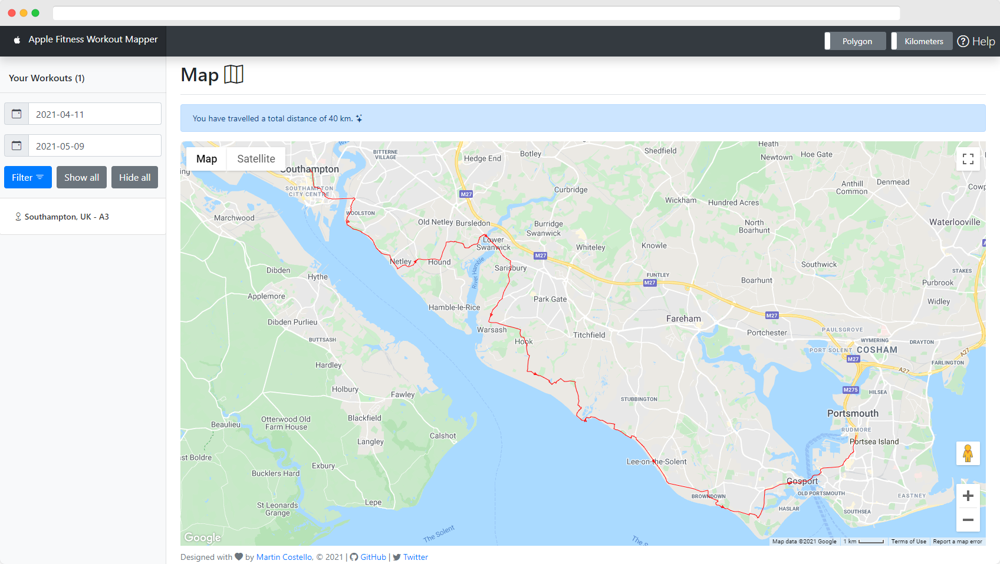

# Apple Fitness Workout Mapper

[](https://github.com/martincostello/apple-fitness-workout-mapper/actions/workflows/build.yml?query=branch%3Amain+event%3Apush)
[](https://codecov.io/gh/martincostello/apple-fitness-workout-mapper)
[](https://securityscorecards.dev/viewer/?uri=github.com/martincostello/apple-fitness-workout-mapper)

## Overview

A .NET web application that lets you visualise the workouts from the Apple Fitness app on a map.



Workout data is obtained by exporting your Health Data from the Apple Health app and importing
it into a local copy of this application running on your own computer.

### Motivation

This application was borne out of a [personal curiosity](https://twitter.com/martin_costello/status/1389216982487158790)
to find out how far I'd been from home when going out for a walk for exercise
during the COVID-19 pandemic in the United Kingdom from March 2020 to May 2021.

While the Apple Fitness app lets you see individual workouts on a map, there is
no functionality to allow you to see _all_ the workouts at once. This
application was created so I could see my own workout data for my walks on a map
to answer that question.

It is made available here for free as an open source software application so
that other people who are similarly curious about where they've been over time
can see the same information from their own Health Data for free ([donations are nice though](https://github.com/sponsors/martincostello) 😉).

### Requirements

To use this application, other than some time and patience to set it up, you
only need the following things:

1. An Apple device that stores Health Data
1. At least one workout with GPS data recorded by the Apple Fitness app
(such as from a workout recorded on an Apple Watch)
1. A Linux, macOS or Windows computer capable of running [.NET 6.0](https://github.com/dotnet/core/blob/main/release-notes/5.0/5.0-supported-os.md#net-5---supported-os-versions)
(running this application is not supported on mobile devices such as iOS or
  Android)

### Getting started

To get started with the application to run it for your own workout data, check
out the [Getting started guide](https://github.com/martincostello/apple-fitness-workout-mapper/blob/main/docs/getting-started.md#getting-started "Getting started").

### Help

If you are having issues with the application, check out the
[help guide](https://github.com/martincostello/apple-fitness-workout-mapper/blob/main/docs/help.md#help "Help").

## Feedback

Any feedback or issues can be added to the issues for this project in
[GitHub](https://github.com/martincostello/apple-fitness-workout-mapper/issues).

## Repository

The repository is hosted in [GitHub](https://github.com/martincostello/apple-fitness-workout-mapper): [https://github.com/martincostello/apple-fitness-workout-mapper.git](https://github.com/martincostello/apple-fitness-workout-mapper.git)

## License

This project is licensed under the
[Apache 2.0](https://github.com/martincostello/apple-fitness-workout-mapper/blob/main/LICENSE) license.

## Building and Testing

### Prerequisites

To be able to build and test the application on your own computer, you will need
the software listed below. You can also optionally install additional software
to help with local development if you would like to customise it or explore how
it works.

#### Required

1. [.NET SDK](https://dotnet.microsoft.com/download)
1. [Git](https://git-scm.com/downloads)
1. [node.js](https://nodejs.org/en/download/)

#### Optional

1. [Visual Studio Code](https://code.visualstudio.com/download)
1. [PowerShell](https://github.com/PowerShell/PowerShell#get-powershell)
1. [Google Chrome](https://www.google.com/chrome/) (to run the UI tests)

To build, publish and test the application locally, run the following command
after cloning the repository if you have PowerShell installed:

```powershell
./build.ps1
```

Otherwise run the following command to build and test the application:

```sh
dotnet test
```
