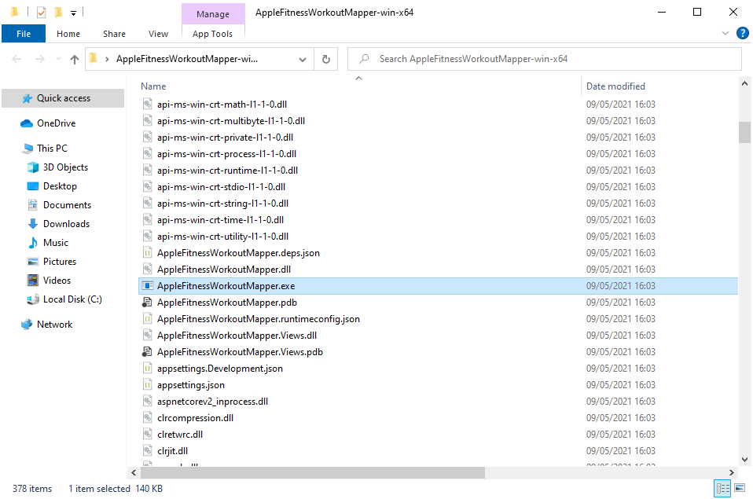
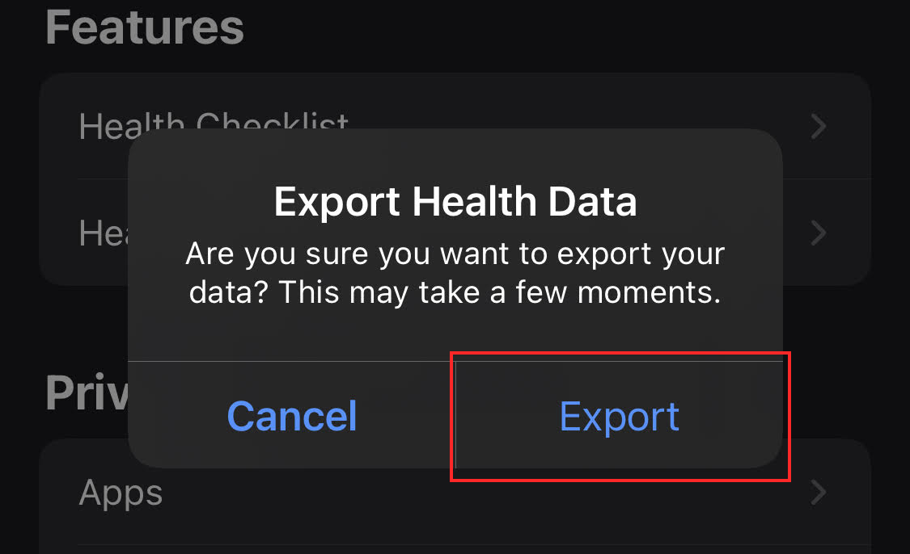
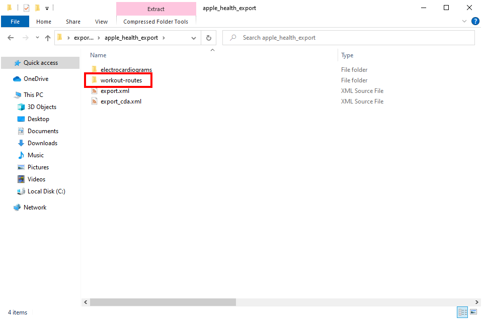

# Getting Started

This guide contains the steps required to install the application on your
computer, get your workout data from your Apple device onto your computer, and
then importing it into the application so you can visualise your workouts.

## Installing Apple Fitness Workout Mapper

### Downloading the application

To install Apple Fitness Workout Mapper, navigate to the
[releases page in GitHub](https://github.com/martincostello/apple-fitness-workout-mapper/releases/latest).

Find the latest stable release and download the ZIP file for the operating
system of the computer you wish to run Apple Fitness Workout Mapper on.

For example, if you have an Apple Mac M2 computer download the
`AppleFitnessWorkoutMapper-osx-arm64.zip` file, or if you have a Windows 10
Intel computer you would download the `AppleFitnessWorkoutMapper-win-x64.zip` file.

If you do not see a specific download for your operating system, then download
the portable version of the application, which is the ZIP file named
`AppleFitnessWorkoutMapper.zip`.

> [!NOTE]
> If you need to use the portable version of the application, you will also
need to install the .NET runtime.
> 
> Instructions for installing .NET can be found here: [_Install .NET on Windows, Linux, and macOS_](https://docs.microsoft.com/dotnet/core/install/).
> 
> Downloads for .NET can be found here: [_Download .NET_](https://dotnet.microsoft.com/download/dotnet).
> The easiest way to install .NET is to install the .NET SDK.

### Running the application

#### Open the application directory in a terminal

Once you have downloaded the ZIP file, unzip it to a directory of your choice
on the computer you wish to run the application on.

On Windows and Linux this will give you a directory that looks something like
this:

On macOS the ZIP file will contain a `AppleFitnessWorkoutMapper.app` file
instead. This is to ensure the application is not flagged as malicious by
macOS and anti-virus software. An AppleFitnessWorkoutMapper icon may appear in
the system tray, but clicking it will not make the application run.

To run Apple Fitness Workout Mapper, open a terminal window and change the
current directory to the directory you extracted the ZIP file to. For example,
on macOS you might run a command similar to
`cd /Users/YourName/Desktop/AppleFitnessWorkoutMapper.app/Contents/MacOS`, or
on Windows `cd C:\Users\YourName\Desktop\AppleFitnessWorkoutMapper-win-x64"`.

Now find the `AppleFitnessWorkoutMapper` or `AppleFitnessWorkoutMapper.exe` file
in the directory you extracted the application to. This is the main file that
runs the application.

#### Unblock the application (Windows only)

On a Windows computer the file may need to be unblocked before you can run
the application. To do this, right-click the application and check the
**Unblock** checkbox and click **Apply** as shown below.

#### Run the application in a terminal

Once the terminal directory is changed to the one containing the application run
the command `./AppleFitnessWorkoutMapper` (for macOS and Linux) or
`AppleFitnessWorkoutMapper.exe` (on Windows) to start the application. If the
application is running successfully, you should see output in your terminal
window similar to the one shown below.

If the application is running successfully you should see no errors or warnings
logged to the terminal and the URL the application is listening on.

#### Opening the user interface

To open the user interface, copy one of the URLs as highlighted below from the
terminal window and visit it in your preferred web browser. The default
recommended URL for you to use is `http://localhost:5000`.

If everything is working correctly, you should see something like the below in
your browser.

At this point the application is ready to have the data imported into it.

If you don't see something like the above in your browser check out the
[help guide](https://github.com/martincostello/apple-fitness-workout-mapper/blob/main/docs/help.md#help).

## Exporting your workout data from an Apple device

> ⚠️ For privacy and security reasons, Apple Health Data is only stored locally
on your Apple Device. To be able to display your workout routes in _Apple
Fitness Workout Mapper_ you will need to export your Health Data to the computer
on which you wish to visualise it from the Apple Health app.
>
> If you are not comfortable with doing this, you will
not be able to use this application as there is no way to access the data
remotely from another device (such as your computer).
>
> Ensure you export your Health Data to a secure location, and delete any
copies of it when you are finished using the application, including from the
`App_Data` directory of any copies of the _Apple Fitness
Workout Mapper_ application itself you have on your computer. It is your own
personal responsibility to keep your Health Data private, safe and secure.
>
> If you are comfortable with exporting your Health Data for use with the
application, then continue below for instructions on how to export your Health
Data from your Apple device.

### Open the Health app

First locate the Health app on your device, and then open it.

### Open your Health profile

Once you've opened the Health app, tap your picture to open your profile.

### Export Health Data

Now scroll to the bottom and tap the _Export All Health Data_ option.

Confirm that you wish to export your Health Data.

The Health app will now start preparing the export of your Health Data.
Depending on how much data you have, this may take several minutes.

Once the export is processed and ready, you will be prompted to share it.

If you have an Apple computer, AirDrop should be the easiest way to share the
Health Data export to your computer to use with the application. Other possible
locations to share the export to include a cloud file storage app, such as
OneDrive.

> ⚠️ Ensure you trust the location you are sharing your Health Data to.

## Configuring a Google Maps API key

> ℹ️ Configuring a Google Maps API key is optional, but without an API key you
> will not be able to remove the _For development purposes only_ overlay from
> the map on which the workouts are rendered.

To configure a Google Maps API key, follow the [instructions that can be found
here](https://developers.google.com/maps/get-started#quickstart) so that you
can use the application without development-only overlays.

Once you have generated an API key, put the value of the key that was generated
into the `GoogleMapsApiKey` setting in the `appsettings.json` file located in
the directory that you extracted the application ZIP file to in the first
section.

> ℹ️ If the application is still running, close it and re-run it for the API key
to be used by the application to render the map.

## Importing your workout data into Apple Fitness Workout Mapper

Once you have shared your Health Data to your computer, you will find a file
with the name `export.zip` where you shared the export to.

Extract the ZIP file to a directory of your choosing. It will contain a single
directory named `apple_health_export`.

Opening this directory will reveal the actual exported health data. The
directory we are interested in here is named `workout-routes`.

Opening this directory will reveal the individual files containing the workout
route data to visualise in the application on a map.

> ℹ️ These files are stored in [GPS Exchange Format](https://en.wikipedia.org/wiki/GPS_Exchange_Format).

Open the `App_Data` directory in the directory you unzipped the application to
in the first section of this guide. The directory will contain a single `.empty`
file by default. If you have already run the application before it may also
contain a `tracks.db` file.

Copy (or move) all of the `.gpx` files from the extracted Health Data export ZIP
file to the `App_Data` directory.

Once you have copied the files to the `App_Data` directory, return to the
application in your web browser and click the _Import workouts_ button.

The application will now start reading the `.gpx` files from the `App_Data`
directory and store them in a local database file in the same directory.

Depending on how many workout files you have and how long your workouts are on
average, this process may take several minutes to complete.

You can see the progress of the import in the terminal window of the
application.

When the import is completed you should see the number imported printed to the
terminal and the map should show you all the workouts that were imported that
have taken place within the last 28 days.

Congratulations! 🥳 You can now explore your workouts from your Apple Health
Data!

> You can now delete any additional copies of your Apple Health Data export,
provided that you retain the files in the `App_Data` directory. If you delete
this directory, you will need to repeat the import process.

## Exploring your workouts

Now that you have imported your Health Data into the application, you can now
explore it to your heart's content in the map. Below are some of the
features that let you see where you've been and other information.

1. Select one or more workouts to highlight them on the map.
1. Select a workout to see the times, the duration, the distance and average
pace. The default units are kilometres and kilometres per hour, but you can use
the toggle in the navigation bar to switch to miles and miles per hour. Hovering
over the distance with your mouse will always show the distance in metres.
1. Show or hide individual workouts on the map.
1. Filter to a specific date range, or see all of the workouts.
1. Toggle the _Polygon_ option to see the area enclosed by your workouts.
1. See the total distance travelled by all the workouts visible on the map. You
can also see the CO2 emissions equivalent saved compared to if you
had driven the same distance instead of walked/ran/cycled.

If there's a feature you'd like doesn't seem to be there, consider [opening a
GitHub issue](https://github.com/martincostello/apple-fitness-workout-mapper/issues)
to request a new feature (or try doing it yourself and opening a Pull Request to
contribute back to the application 😃).

Enjoy!
