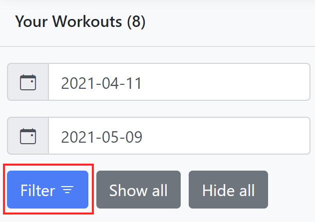

# Help

This guide contains information to help you troubleshoot issues with the app.

## Troubleshooting

## FAQs

### _How do I change from kilometres to miles?_

By default the application uses kilometres to measure distances and kilometres
per hour to measure pace. To change the units to miles and miles per hour, click
the _Kilometres_ option in the top right-hand corner of the navigation bar to
change the units to _Miles_.

The option you choose will be saved and used next time you use the application
in the same browser and from the same URL.

### _I've imported the data but there are no workouts shown_

By default the application only shows workouts dated within the last 28 days.
Try changing the date range and clicking the "Filter" button to load more
workouts.

If there are still no workouts, check the logs printed to the terminal when the
application is running to see if there were any warnings or errors when you
imported the data. Check for:

* All workout data has been placed in the data directory (which by default is
  the `App_Data` directory in the application's directory).
* All workout data file names end in `.gpx`.
* There are no invalid/corrupt `.gpx` files in the data directory.
